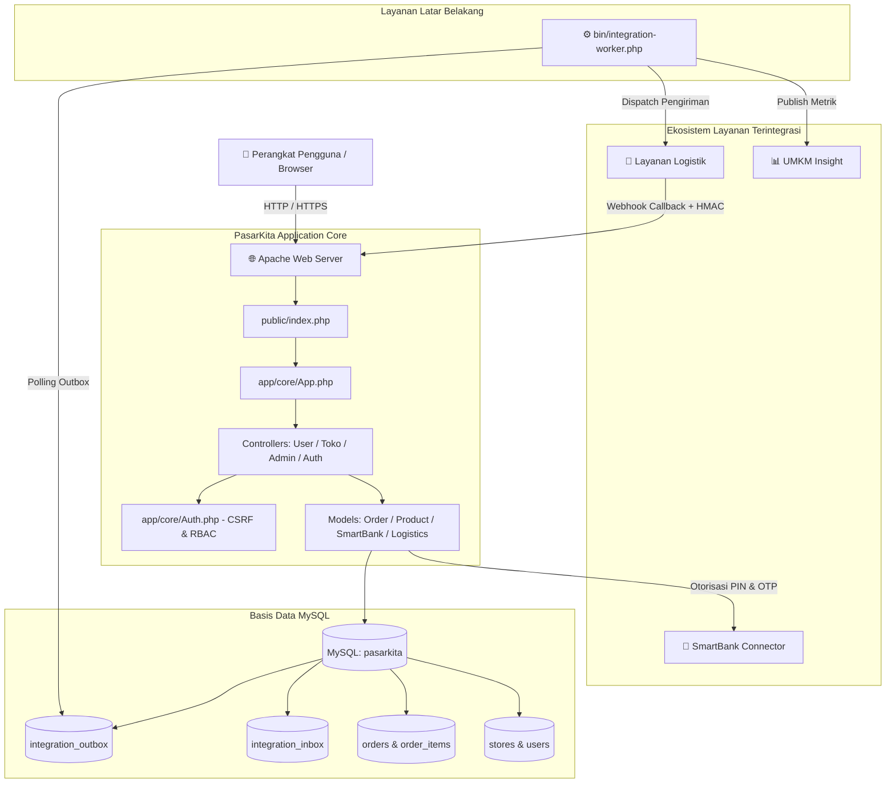
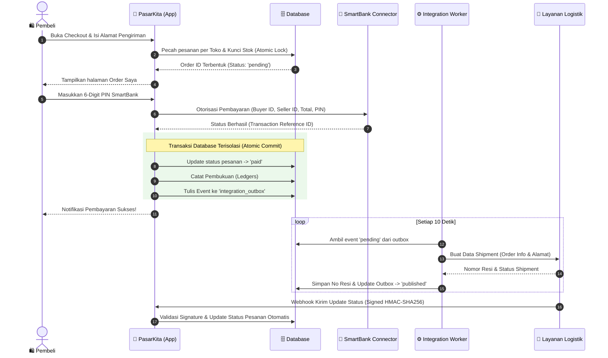
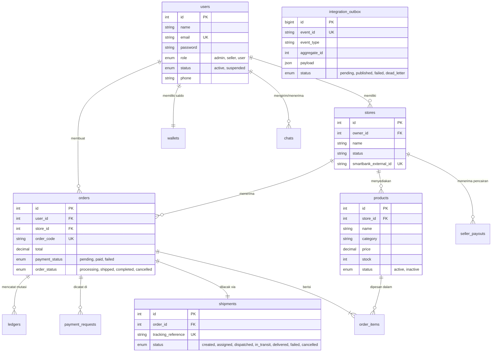

# 🛒 PasarKita - Production-Ready UMKM Marketplace Ecosystem

[](https://php.net)
[]()
[]()
[]()
[]()

Selamat datang di dokumentasi resmi **PasarKita**, platform e-commerce marketplace berbasis web yang dirancang khusus untuk memfasilitasi transaksi digital para pelaku Usaha Mikro, Kecil, dan Menengah (UMKM) serta konsumen secara aman, andal, dan terukur.

Dokumentasi ini menyajikan analisis mendalam mengenai evolusi aplikasi dari versi purwarupa (*PasarKita - before*) menjadi versi produksi modern terintegrasi (*Current PasarKita*), diagram rancangan sistem, serta panduan instalasi lengkap untuk dijalankan di laptop atau server lain.

---

## 📑 Daftar Isi
1. [Deskripsi Aplikasi](#1-deskripsi-aplikasi)
2. [Matriks Perbandingan: Sebelum vs Sesudah Pembaruan](#2-matriks-perbandingan-sebelum-vs-sesudah-pembaruan)
3. [Fitur-Fitur Aplikasi: Sebelum vs Sesudah di-Update](#3-fitur-fitur-aplikasi-sebelum-vs-sesudah-di-update)
4. [Sistem & Arsitektur Aplikasi: Sebelum vs Sesudah di-Update](#4-sistem--arsitektur-aplikasi-sebelum-vs-sesudah-di-update)
5. [Apa Saja yang Ditambahkan pada Aplikasi](#5-apa-saja-yang-ditambahkan-pada-aplikasi)
6. [Rancangan Sistem & Visualisasi Alur (Mudah Dipahami)](#6-rancangan-sistem--visualisasi-alur-mudah-dipahami)
7. [Panduan Menjalankan Aplikasi di Laptop Lain](#7-panduan-menjalankan-aplikasi-di-laptop-lain)
8. [Akun Pengujian (Seed Data)](#8-akun-pengujian-seed-data)
9. [Dokumentasi API & Pengujian Otomatis](#9-dokumentasi-api--pengujian-otomatis)
10. [Panduan Troubleshooting](#10-panduan-troubleshooting)

---

## 1. 📖 Deskripsi Aplikasi

**PasarKita** adalah platform marketplace digital *multi-store* yang dibangun menggunakan arsitektur **MVC (Model-View-Controller) Native PHP** dengan standar *clean code*, modularitas tinggi, dan keandalan tingkat *production-ready*. Aplikasi ini dirancang untuk memberdayakan produsen lokal UMKM dengan menghubungkan mereka secara langsung ke konsumen luas melalui ekosistem digital terpadu:

- **Integrasi SmartBank Connector:** Sistem pembayaran nir-tunai berbasis otorisasi PIN 6-digit dan penautan akun dompet (*wallet linkage*) melalui kode OTP aman (*Open Banking Standard*), tanpa menyimpan PIN di server PasarKita.
- **Logistika Microservice & Asynchronous Outbox Worker:** Pengiriman pesanan terotomasi dengan pola *Transactional Outbox Pattern*, pemrosesan antrean latar belakang (*background CLI worker*), *exponential backoff retry*, serta penerimaan pembaruan status kurir via *Webhook terenkripsi HMAC-SHA256*.
- **UMKM Insight Events:** Integrasi pengiriman metrik pembayaran berhasil secara *real-time* ke platform analitik UMKM.
- **Pemisahan Multi-Store Otomatis (Order Splitting):** Keranjang belanja fleksibel yang memisahkan satu kali transaksi *checkout* dari beberapa toko menjadi pesanan individual per penjual demi kemudahan pemenuhan barang dan pelacakan kurir.

---

## 2. ⚖️ Matriks Perbandingan: Sebelum vs Sesudah Pembaruan

Berikut adalah ikhtisar komparasi mendasar antara versi purwarupa (*before*) dengan versi mutakhir (*production*):

| Aspek | PasarKita (Sebelum Update / *Before*) | PasarKita (Sesudah Update / *Production*) |
| :--- | :--- | :--- |
| **Arsitektur Sistem** | Monolitik sederhana dengan logika bisnis dan database yang saling mengikat ketat (*tightly coupled*). | Arsitektur MVC terstandarisasi dengan pemisahan domain entitas, *Service Layer*, dan *Event-Driven Outbox Pattern*. |
| **Model Finansial & Saldo** | Kolom `balance` lokal di tabel `users`. Simulasi saldo internal/fiktif tanpa audit perbankan resmi. | Terkoneksi ke **SmartBank Connector Microservice**. Transaksi didelegasikan ke Payment Gateway eksternal dengan PIN & OTP. |
| **Pemisahan Entitas Toko** | Data toko tergabung langsung di tabel `users` (`store_name`, `store_banner`). Tidak ada entitas toko mandiri. | Entitas **`stores`** berdiri sendiri. Satu pengguna penjual memiliki profil toko terpisah dengan `smartbank_external_id`. |
| **Multi-Store Checkout** | Tidak mendukung pemisahan pesanan. Produk dari banyak penjual digabung paksa ke dalam satu nomor order. | Mendukung **Store Splitting**: Satu keranjang multi-toko otomatis dipecah menjadi beberapa nomor pesanan independen per toko. |
| **Pengiriman & Kurir** | Kurir di-*hardcode* statis (JNE, J&T). Pembaruan status paket harus diubah manual satu per satu oleh pengguna ber-role `operator`. | Terintegrasi ke **Layanan Logistika**. Pengiriman di-*dispatch* otomatis via worker latar belakang dan status terupdate via Webhook. |
| **Keamanan (Security)** | Rentan: Tanpa token CSRF, tanpa proteksi *brute force*, tanpa rate limiting, atribut cookie sesi standar. | **Enterprise Grade:** Proteksi CSRF (`hash_equals`), Rate Limiting (PIN & Login), Cookie `HttpOnly` & `SameSite=Lax`, XSS filtering. |
| **Reliabilitas & Queue** | Semua pemrosesan bersifat sinkronus (*blocking*). Jika server eksternal down, transaksi gagal total. | **Transactional Outbox & Inbox Pattern**, background worker, *exponential backoff retry*, dan *dead-letter queue*. |
| **Webhooks & Callback** | Belum tersedia atau hanya endpoint dummy tanpa verifikasi tanda tangan kriptografi. | Callback aman divalidasi dengan **HMAC-SHA256 signature**, timestamp drift check (≤300s), dan proteksi *replay attack* (Idempotent). |
| **Konfigurasi Lingkungan** | Kredensial database di-*hardcode* di dalam kode program (`config/db.php`). | Berbasis **`.env` file loader**, mendukung *container environment variables override*. |
| **Deployment & Testing** | Dijalankan manual di server web lokal. Tidak ada pengujian unit otomatis. | Dilengkapi **Dockerfile**, **Apache VirtualHost**, pengujian unit konsistensi otomatis, dan **Swagger/OpenAPI docs**. |

---

## 3. 🚀 Fitur-Fitur Aplikasi: Sebelum vs Sesudah di-Update

### A. Rincian Fitur Berdasarkan Peran Pengguna

#### 1. 🛍️ Konsumen / Pembeli (`user`)
- **Sebelum Update:**
  - Katalog produk standar dan keranjang belanja.
  - Simulasi checkout dengan memotong kolom saldo internal akun.
  - Tracking pesanan menunggu perubahan manual operator.
- **Sesudah Update:**
  - **Katalog Dinamis & Filter Harga:** Pencarian kata kunci produk, kategori dinamis, serta filter rentang harga (*min & max price*).
  - **SmartBank Wallet Linkage:** Penautan akun dompet digital resmi menggunakan request OTP dan verifikasi OTP dari SmartBank.
  - **Smart Checkout & Multi-Store Splitting:** Pembelian dari beberapa toko sekaligus otomatis dipisah per toko dengan rincian ongkir, pajak, dan *marketplace fee* yang transparan.
  - **Voucher Promo Belanja:** Validasi dan penerapan kupon diskon (*percentage* maupun *fixed cut*).
  - **Pembayaran Terproteksi dengan PIN:** Otorisasi pembayaran pesanan dilakukan dari halaman "Order Saya" dengan input 6-digit PIN SmartBank yang diawasi sistem pembatasan percobaan (*rate-limit lock*).
  - **Live Chat Penjual:** Berkirim pesan instan langsung dengan pemilik toko terkait detail produk sebelum checkout.
  - **Pembatalan Pesanan Aman:** Tombol pembatalan pesanan yang secara otomatis mengembalikan jumlah stok produk ke etalase toko.

#### 2. 🏪 Penjual / Pelapak (`seller`)
- **Sebelum Update:**
  - Formulir CRUD produk sederhana.
  - Daftar pesanan tercampur tanpa pemisahan status toko yang jelas.
- **Sesudah Update:**
  - **Pendaftaran Toko Mandiri:** Pengguna biasa dapat membuka toko dan otomatis memperoleh hak akses sebagai *seller*.
  - **Manajemen Produk Lengkap:** Tambah produk baru, edit nama/harga/stok/gambar, serta status aktif/nonaktif.
  - **Wallet Settlement Toko:** Penautan wallet toko ke SmartBank untuk penerimaan pembayaran hasil penjualan (*seller payout*).
  - **Dashboard Performa Penjualan:** Statistik pendapatan toko, ringkasan pesanan, produk terlaris (*best sellers*), dan notifikasi stok menipis (*low stock alert*).
  - **Pemrosesan Pesanan Toko:** Pengelolaan status pesanan milik tokonya sendiri secara terisolasi dari toko lain.
  - **Chat Balasan Konsumen:** Ruang percakapan terpadu untuk merespons pertanyaan pembeli secara *real-time*.

#### 3. 👑 Administrator (`admin`)
- **Sebelum Update:**
  - Tabel pengguna dan daftar pesanan sederhana.
- **Sesudah Update:**
  - **Dashboard Analitik Eksekutif:** Visualisasi metrik total pendapatan platform, volume pesanan, tren produk, dan status distribusi pengguna.
  - **Manajemen & Moderasi Pengguna:** Kemampuan menangguhkan (*suspend*) atau mengaktifkan kembali akun pengguna yang melanggar ketentuan.
  - **Monitoring Multi-Toko:** Pemantauan status seluruh toko mitra UMKM beserta performa finansial dan jumlah produk aktif.
  - **Marketplace Treasury SmartBank:** Pengaturan rekening kas utama (*treasury wallet*) PasarKita yang menerima dana penampungan transaksi sebelum *settlement*.
  - **Audit Log & Ledger:** Pemantauan mutasi pembukuan digital (*debit, credit, platform fee, tax*).

#### 4. 🤖 Sistem Integrasi & Otomasi (Menggantikan Role Operator Manual)
- **Sebelum Update:** Status pesanan diubah secara manual satu per satu oleh pengguna dengan role `operator`.
- **Sesudah Update:** Sistem otomatisasi penuh:
  - **Background Worker (`integration-worker.php`):** Mengambil transaksi berstatus `paid` dari tabel `integration_outbox` dan mendaftarkan pengiriman ke sistem Logistika tanpa campur tangan manusia.
  - **Automated Webhook Receiver:** Saat kurir memperbarui status di jalan (*dispatched, in_transit, delivered*), webhook PasarKita otomatis memperbarui status shipment dan pesanan.

---

## 4. 🏗️ Sistem & Arsitektur Aplikasi: Sebelum vs Sesudah di-Update

### Perbandingan Alur & Mekanisme Internal

```
SEBELUM UPDATE (Purwarupa / Legacy):
[Pengguna] ──> [Checkout Controller] ──> Cek Saldo Lokal (users.balance) ──> Sukses (Simulasi)
                                                          │
                                         [Operator mengubah status manual]

SESUDAH UPDATE (Event-Driven Production):
[Pengguna] ──> [Multi-Store Checkout] ──> [Pending Order + Atomic Stock Lock]
                     │
                     ▼
          [Otorisasi PIN SmartBank] ──> [SmartBank Connector API]
                     │ (Sukses)
                     ▼
       [Transactional DB Commit]
         ├── 1. Update Order -> 'paid'
         ├── 2. Catat Buku Besar (Ledgers)
         └── 3. Simpan Event ke 'integration_outbox'
                     │
         ┌───────────┴──────────────────────────────┐
         ▼                                          ▼
[Worker: Logistika Service]             [Worker: UMKM Insight Events]
         │ (Resi Diterbitkan)                       │ (Analitik Tercatat)
         ▼                                          ▼
[Webhook Callback via HMAC-SHA256] ──> [Inbox Idempotency Guard] ──> [Update Auto Status]
```

### Keamanan Sistem (Enterprise Security Features)
1. **CSRF Protection:** Seluruh formulir HTTP POST mewajibkan token tersembunyi melalui fungsi `csrf_field()` yang divalidasi secara aman menggunakan `hash_equals()`.
2. **Rate Limiting:** Proteksi serangan *brute force* pada formulir autentikasi login (maksimal 5 percobaan per 5 menit) dan otorisasi PIN pembayaran (maksimal 3 kesalahan per 5 menit).
3. **HTTP Cookie Hardening:** Cookie sesi diamankan dengan konfigurasi `HttpOnly`, `SameSite=Lax`, dan `Secure` pada koneksi HTTPS untuk memitigasi serangan XSS dan pencurian sesi.
4. **Signature Verification & Anti-Replay:** Callback eksternal wajib menyertakan header `X-B2BLink-Signature` (HMAC-SHA256) serta header `X-B2BLink-Event-Id` yang disimpan di tabel `integration_inbox` untuk mencegah pemrosesan ulang paket data (*idempotent guard*).

---

## 5. ➕ Apa Saja yang Ditambahkan pada Aplikasi

Berikut adalah rincian penambahan dan restrukturisasi kode pada versi produksi:

### 1. File Konfigurasi & Infrastruktur Baru
- [`.env.example`](file:///.env.example) & [`.env`](file:///.env): Konfigurasi variabel lingkungan (*decoupled configuration*).
- [`Dockerfile`](file:///Dockerfile): Konfigurasi kontainerisasi Apache PHP 8.3 dengan ekstensi `pdo_mysql`, `curl`, dan `mod_rewrite`.
- [`docker-entrypoint.sh`](file:///docker-entrypoint.sh): Skrip *entrypoint* otomatis yang mengeksekusi worker integrasi di *background* bersamaan dengan server web Apache.
- [`docker/apache.conf`](file:///docker/apache.conf): Konfigurasi VirtualHost Apache yang mengarahkan DocumentRoot secara aman ke folder `/public`.

### 2. Model & Logika Bisnis Baru (`app/models/`)
- [`SmartBank_model.php`](file:///app/models/SmartBank_model.php): Klien API untuk komunikasi dengan gateway SmartBank Connector (OTP, linkage dompet, eksekusi pembayaran PIN, *idempotency keys*).
- [`Logistics_model.php`](file:///app/models/Logistics_model.php): Pengelola antrean transaksi *outbox*, pengirim pesanan ke Logistika, serta penerima webhook callback.
- [`Cart_model.php`](file:///app/models/Cart_model.php): Pengelolaan keranjang multi-toko berbasis sesi dengan kalkulasi pajak, diskon voucher, dan ongkir per toko.
- [`Store_model.php`](file:///app/models/Store_model.php): Pengelolaan data entitas toko dan penautan ke rekening penjual.
- [`Voucher_model.php`](file:///app/models/Voucher_model.php): Mesin promo voucher belanja.

### 3. Background Processing & CLI (`bin/`)
- [`bin/integration-worker.php`](file:///bin/integration-worker.php): Daemon pemroses antrean latar belakang untuk mendispatch event `MARKETPLACE_ORDER_PAID` dan `UMKM_INSIGHT_PAYMENT_SETTLED`.

### 4. Controller & Dokumentasi API Baru (`app/controllers/`)
- [`Docs.php`](file:///app/controllers/Docs.php): Endpoint dokumentasi OpenAPI/Swagger bawaan (`/docs` dan `/docs/openapi`).
- [`Integration.php`](file:///app/controllers/Integration.php): Endpoint webhook penerima callback status pengiriman kurir.
- Refaktor [`Admin.php`](file:///app/controllers/Admin.php), [`User.php`](file:///app/controllers/User.php), dan [`Toko.php`](file:///app/controllers/Toko.php) untuk mendukung otorisasi peran ketat, proteksi CSRF, dan antarmuka SmartBank.

### 5. Pengujian Kualitas & Unit Test (`tests/`)
- [`tests/MarketplaceConsistencyTest.php`](file:///tests/MarketplaceConsistencyTest.php): Suite pengujian otomatis untuk memvalidasi pemetaan status logistik, konversi pembulatan nominal mata uang, dan prioritas *environment variables*.

---

## 6. 📐 Rancangan Sistem & Visualisasi Alur (Mudah Dipahami)

### A. Diagram Arsitektur Komponen (Architecture Diagram)



---

### B. Diagram Alur Transaksi & Pembayaran (Sequence Flow)



---

### C. Diagram Relasi Entitas Database (Entity Relationship Diagram)



---

## 7. 💻 Panduan Menjalankan Aplikasi di Laptop Lain

Ikuti salah satu dari dua metode di bawah ini untuk menjalankan aplikasi pada komputer/laptop lain:

### Opsi A: Menjalankan Menggunakan XAMPP / Laragon (Metode Lokal Standar)

#### 1. Prasyarat Perangkat Lunak
- **PHP:** Versi 8.2 atau lebih baru (pastikan ekstensi `pdo_mysql`, `curl`, `mbstring`, dan `openssl` aktif di `php.ini`).
- **MySQL / MariaDB:** Versi 10.4+ / 8.0+.
- **Apache Web Server:** Dengan modul `mod_rewrite` diaktifkan.

#### 2. Penempatan Berkas Proyek
1. Buka folder instalasi server lokal:
   - Pengguna **XAMPP**: Masuk ke `C:\xampp\htdocs\`
   - Pengguna **Laragon**: Masuk ke `C:\laragon\www\`
2. Salin (*copy*) seluruh folder proyek `pasarkita` ke dalam direktori tersebut sehingga strukturnya menjadi:
   ```text
   C:\xampp\htdocs\pasarkita\
   ```

#### 3. Setup Konfigurasi Lingkungan (`.env`)
1. Di dalam folder utama `pasarkita`, buat salinan berkas `.env.example` dan ubah namanya menjadi `.env`:
   ```bash
   cp .env.example .env
   ```
2. Buka berkas `.env` menggunakan editor teks (VS Code, Notepad, dll), lalu sesuaikan nilainya:
   ```env
   APP_NAME=PasarKita
   APP_ENV=local
   APP_DEBUG=true
   BASEURL=http://localhost/pasarkita/public/

   DB_HOST=localhost
   DB_USER=root
   DB_PASS=
   DB_NAME=pasarkita

   # Integrasi Layanan Eksternal (Opsional / Jika Diperlukan)
   SMARTBANK_CONNECTOR_URL=http://localhost:5000
   SMARTBANK_CONNECTOR_API_KEY=
   SMARTBANK_MARKETPLACE_EXTERNAL_ID=marketplace-merchant-main
   SMARTBANK_CONNECTOR_TIMEOUT_MS=10000

   LOGISTIKA_URL=
   LOGISTIKA_API_KEY=
   INTEGRATION_WEBHOOK_SECRET=
   UMKM_INSIGHT_EVENTS_URL=
   ```
   > 💡 *Catatan:* Jika MySQL di laptop kamu menggunakan port atau kata sandi khusus, sesuaikan `DB_PASS` dan `DB_HOST`.

#### 4. Import Basis Data
1. Buka browser dan akses **phpMyAdmin** (`http://localhost/phpmyadmin`).
2. Buat database baru bernama: **`pasarkita`** dengan collation `utf8mb4_unicode_ci`.
3. Pilih database `pasarkita`, lalu buka tab **Import**.
4. Pilih file [`database/pasarkita.sql`](file:///database/pasarkita.sql) dan klik **Import**.
5. *(Opsional)* Jika ingin memastikan seluruh tabel integrasi produksi terbaru telah siap, jalankan script tambahan:
   - [`database/migrate_production_integrations.sql`](file:///database/migrate_production_integrations.sql)
   - [`database/migrate_smartbank_seller.sql`](file:///database/migrate_smartbank_seller.sql)

#### 5. Menjalankan Background Worker
Aplikasi menggunakan worker latar belakang untuk memproses pesanan dan integrasi logistik. Buka terminal atau Command Prompt baru di laptop kamu:
```bash
cd C:\xampp\htdocs\pasarkita
php bin/integration-worker.php
```
> Biarkan jendela terminal ini tetap terbuka selama pengujian transaksi berlangsung.

#### 6. Akses Aplikasi di Browser
Buka browser favorit kamu dan navigasikan ke alamat:
👉 **`http://localhost/pasarkita/public/`**

---

### Opsi B: Menjalankan Menggunakan Docker (Metode Praktis & Terisolasi)

Jika laptop tujuan memiliki **Docker Desktop**, kamu dapat menjalankan aplikasi tanpa perlu menginstal PHP atau Apache manual:

1. Buka terminal di direktori proyek:
   ```bash
   cd pasarkita
   ```
2. Pastikan file `.env` sudah dikonfigurasi.
3. Build image dan jalankan container:
   ```bash
   docker build -t pasarkita-app .
   docker run -d -p 8080:80 --name pasarkita pasarkita-app
   ```
4. Akses aplikasi melalui browser di alamat:
   👉 **`http://localhost:8080/`**

---

## 8. 🔑 Akun Pengujian (Seed Data)

Basis data awal telah dilengkapi akun siap pakai untuk setiap peran. Seluruh akun menggunakan kata sandi default yang sama:

> 🔐 **Kata Sandi Default:** **`admin123`**

| Role (Peran) | Email Akun | Password Default | Keterangan Hak Akses |
| :--- | :--- | :--- | :--- |
| **👑 Admin** | `admin@pasarkita.test` | `admin123` | Akses penuh: Dashboard finansial, kontrol status user, monitoring multi-toko, wallet kas platform. |
| **🏪 Seller** | `seller@pasarkita.test` | `admin123` | Pemilik toko *"Dapur Sari"*: Manajemen produk, pemrosesan order, performa toko, chat pembeli. |
| **🛍️ Pembeli** | `user@pasarkita.test` | `admin123` | Konsumen *"Budi Pembeli"*: Belanja produk, kelola keranjang, input voucher, otorisasi PIN SmartBank. |

*(Pengguna baru juga dapat mendaftar sebagai konsumen secara langsung melalui menu Registrasi).*

---

## 9. 🧪 Dokumentasi API & Pengujian Otomatis

### A. Akses Dokumentasi Swagger / OpenAPI
PasarKita dilengkapi dengan spesifikasi OpenAPI 3.0 bawaan. Kamu dapat melihat daftar endpoint dan skema payload melalui rute:
- **UI Dokumentasi:** `http://localhost/pasarkita/public/docs`
- **JSON Schema:** `http://localhost/pasarkita/public/docs/openapi`

### B. Menjalankan Unit Consistency Test
Untuk memverifikasi bahwa lingkungan PHP, pemetaan status kurir, dan kalkulasi nominal mata uang telah berjalan dengan benar pada laptop kamu, jalankan perintah:
```bash
php tests/MarketplaceConsistencyTest.php
```

Hasil yang diharapkan:
```text
Running Marketplace consistency checks...
✔ Logistics callback mapping test passed (failed -> cancelled).
✔ Safe integer money conversion test passed.
✔ Container environment overrides local .env values.
All Marketplace consistency unit assertions PASSED!
```

---

## 10. 🛠️ Panduan Troubleshooting

| Masalah yang Terjadi | Penyebab Umum | Solusi Perbaikan |
| :--- | :--- | :--- |
| **Halaman 404 saat membuka rute** (misal `/user`, `/auth/login`) | Modul `mod_rewrite` Apache belum aktif atau `.htaccess` tidak terbaca. | Pastikan `AllowOverride All` aktif di konfigurasi Apache (`httpd.conf`) dan modul `rewrite_module` telah dicentang. |
| **Koneksi Database Gagal** (`Connection failed`) | Kredensial di berkas `.env` tidak sesuai dengan konfigurasi MySQL lokal. | Buka `.env`, pastikan `DB_USER` (biasanya `root`), `DB_PASS` (kosong di XAMPP, `root` di Laragon), dan `DB_NAME=pasarkita` sudah benar. |
| **Invalid CSRF Token** | Sesi browser kadaluwarsa atau token tidak terkirim via form. | Segarkan halaman browser (*refresh* F5), lalu kirim ulang form. Pastikan cookie diizinkan pada browser. |
| **Pembayaran SmartBank Gagal** | API Connector SmartBank belum dijalankan atau API Key kosong. | Pastikan service SmartBank Connector menyala di port 5000, atau sesuaikan nilai `SMARTBANK_CONNECTOR_URL` pada berkas `.env`. |

---
**PasarKita Core Engineering Team**  
*Mendukung Digitalisasi dan Pertumbuhan Ekonomi Kreatif UMKM Indonesia.*
